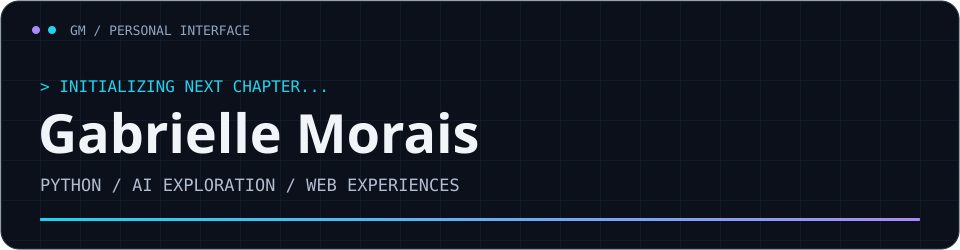
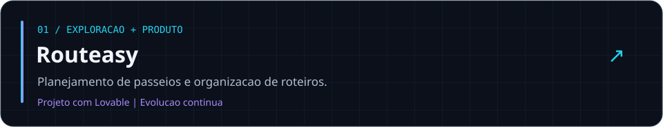
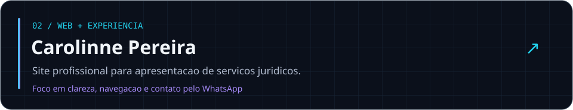
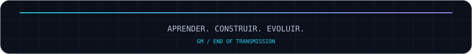

<!-- Perfil: GabrielleMorais. Envie também a pasta assets deste pacote. -->
<p align="center">
  
</p>
<p align="center">
  
</p>
<p align="center">
  
  
</p>
<p align="center">
  <a href="#sobre-mim">Sobre mim</a> · <a href="#tech-stack">Stack</a> · <a href="#projetos">Projetos</a> · <a href="#atividade">Atividade</a> · <a href="#conexoes">Conexões</a>
</p>

## Sobre mim

Olá! Sou **Gabrielle Morais**, em transição de carreira para tecnologia, com foco em **Inteligência Artificial e Python**.

Minha experiência comercial me aproxima das necessidades das pessoas. Agora, estou aprendendo a transformar essas necessidades em soluções digitais, combinando estudo de programação, projetos práticos e uso crítico de IA.

- **Na prática:** estudo Python, resolvo exercícios e construo projetos para a web.
- **Minha trilha:** Python com Guanabara, cursos e bootcamps da DIO e experiências com Lovable.
- **Como aprendo:** testo, identifico erros, ajusto e busco entender o que estou construindo.
- **Próximo passo:** uma oportunidade de estágio em tecnologia para colaborar e aprender todos os dias.

> Cada projeto é uma oportunidade de entender melhor o código e o problema que ele resolve.

## Tech Stack

**Fundamentos em aprendizado e prática**

<p>
  
  
  
  
  
</p>

### Ferramentas utilizadas

<p>
  
  
  
  
  
</p>

Uso IA como apoio para explorar ideias, estudar e desenvolver — com atenção à revisão e à compreensão dos resultados.

## Projetos

<a href="https://routeasy.lovable.app">
  
</a>

**Routeasy** — Exploro planejamento de roteiros, preferências do usuário e sugestões de lugares. Um projeto em evolução para praticar construção de produto, interface e integrações.

[Abrir projeto ↗](https://routeasy.lovable.app)

<a href="https://carolinnemorais.gabriellepereirademo.chatgpt.site">
  
</a>

**Site jurídico** — Apresentação de áreas de atuação com foco em navegação clara, adaptação a diferentes telas e contato pelo WhatsApp.

[Abrir projeto ↗](https://carolinnemorais.gabriellepereirademo.chatgpt.site)

## Objetivos atuais

```text
 gabrielle@dev:~$ cat objetivos.txt

 [EM CURSO]  Consolidar lógica de programação e Python
 [EM CURSO]  Praticar Git e organizar meus repositórios
 [EM CURSO]  Desenvolver interfaces claras e responsivas
 [PRÓXIMO]   Aprofundar consumo de APIs e automações
 [DIREÇÃO]   Construir uma base sólida para trabalhar com IA
 [CARREIRA]  Conquistar um estágio em tecnologia

 gabrielle@dev:~$ próximo_passo
 Estudar → praticar → revisar → documentar
```

## Atividade

<p align="center">
  <a href="https://github.com/GabrielleMorais?tab=repositories">
    
  </a>
</p>
<p align="center">
  
</p>
<p align="center">
  
</p>
<p align="center">
  
</p>

<details>
<summary><b>GitHub Trophies · ver conquistas da plataforma</b></summary>
<br />
<p align="center">
  
</p>
</details>

### Contribution Snake

<p align="center">
  <picture>
    <source media="(prefers-color-scheme: dark)" srcset="https://raw.githubusercontent.com/GabrielleMorais/GabrielleMorais/output/github-snake-dark.svg" />
    <source media="(prefers-color-scheme: light)" srcset="https://raw.githubusercontent.com/GabrielleMorais/GabrielleMorais/output/github-snake.svg" />
    
  </picture>
</p>

## Conexões

Estou aberta a conversar sobre **estágios em tecnologia, projetos e aprendizado**.

<p align="center">
  <a href="https://www.linkedin.com/in/gabrielle-morais-777a202ba/"></a>
  <a href="https://github.com/GabrielleMorais?tab=repositories"></a>
</p>

<p align="center">
  
</p>
